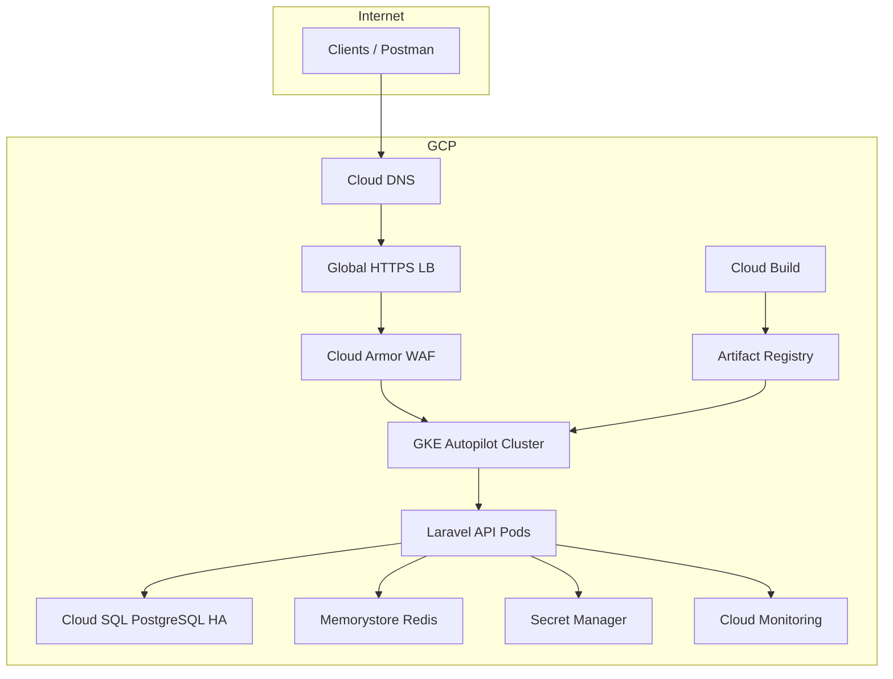

# GCP Deployment Plan — Inventory Management API

This document is the step-by-step deployment plan for running the Inventory Management API on Google Cloud Platform using the assets in this repository:

| Asset | Path |
|-------|------|
| Terraform (IaC) | `infrastructure/terraform/` |
| Kubernetes manifests | `infrastructure/k8s/` |
| CI/CD pipeline | `cloudbuild.yaml` |
| Container image | `docker/Dockerfile` |

**Target architecture:** GKE Autopilot → Laravel API pods → Cloud SQL (PostgreSQL HA) + Memorystore (Redis) + Cloud Storage + Secret Manager, fronted by Global HTTPS Load Balancer with Cloud Armor.

---

## 1. Deployment Overview



### Phases and estimated duration

| Phase | Activity | Duration (estimate) |
|-------|----------|---------------------|
| 0 | Prerequisites & project bootstrap | 0.5–1 day |
| 1 | Terraform — core infrastructure | 1–2 days |
| 2 | Kubernetes bootstrap & secrets | 0.5–1 day |
| 3 | Application deploy & DB migrate | 0.5 day |
| 4 | Ingress, DNS, managed SSL | 0.5–1 day |
| 5 | Cloud Build CI/CD | 0.5 day |
| 6 | Monitoring, alerts, runbook | 0.5 day |
| 7 | Security hardening & go-live | 1 day |

**Total:** ~5–7 working days for first production deployment (excluding security review cycles).

---

## 2. Prerequisites

### 2.1 GCP account & project

- [ ] GCP organization/project with billing enabled
- [ ] Project ID chosen (e.g. `inventory-prod-123456`)
- [ ] Owner or sufficient IAM on the project

### 2.2 Local tools

```bash
gcloud --version    # Google Cloud SDK
terraform --version # >= 1.5
kubectl version     # Kubernetes CLI
docker --version
```

### 2.3 Authentication

```bash
gcloud auth login
gcloud auth application-default login
gcloud config set project YOUR_PROJECT_ID
```

### 2.4 Domain (production)

- [ ] Registered domain (e.g. `api.inventory.example.com`)
- [ ] Access to DNS for Cloud DNS zone creation

### 2.5 Enterprise sizing (from TRD)

| Component | Configuration |
|-----------|---------------|
| GKE Autopilot | 3+ replicas (HPA 3–20) |
| Cloud SQL | `db-custom-4-16384` HA regional |
| Redis | 5 GB Memorystore STANDARD_HA |
| Load Balancer | Global HTTPS |
| Cloud Armor | Enterprise policies (recommended) |

---

## 3. Phase 0 — Project Bootstrap

### 3.1 Enable APIs

```bash
gcloud services enable \
  compute.googleapis.com \
  container.googleapis.com \
  sqladmin.googleapis.com \
  redis.googleapis.com \
  secretmanager.googleapis.com \
  artifactregistry.googleapis.com \
  cloudbuild.googleapis.com \
  servicenetworking.googleapis.com \
  monitoring.googleapis.com \
  logging.googleapis.com \
  dns.googleapis.com \
  pubsub.googleapis.com \
  cloudresourcemanager.googleapis.com \
  iam.googleapis.com
```

### 3.2 Create Terraform state bucket (recommended)

```bash
export PROJECT_ID=YOUR_PROJECT_ID
export REGION=us-central1

gsutil mb -l $REGION gs://${PROJECT_ID}-terraform-state
gsutil versioning set on gs://${PROJECT_ID}-terraform-state
```

Add backend to `infrastructure/terraform/main.tf` (optional but recommended for teams):

```hcl
terraform {
  backend "gcs" {
    bucket = "YOUR_PROJECT_ID-terraform-state"
    prefix = "inventory-api"
  }
}
```

### 3.3 IAM — human operators

Grant deploy roles to the CI/CD and ops team:

| Principal | Roles |
|-----------|-------|
| DevOps lead | `roles/container.admin`, `roles/cloudsql.admin`, `roles/secretmanager.admin` |
| Cloud Build SA | `roles/container.developer`, `roles/artifactregistry.writer`, `roles/cloudbuild.builds.builder` |
| On-call | `roles/monitoring.admin`, `roles/logging.viewer` |

---

## 4. Phase 1 — Terraform Infrastructure

### 4.1 Configure variables

```bash
cd infrastructure/terraform
cp terraform.tfvars.example terraform.tfvars
```

Edit `terraform.tfvars`:

```hcl
project_id      = "YOUR_PROJECT_ID"
region          = "us-central1"
environment     = "production"
db_tier         = "db-custom-4-16384"
redis_memory_gb = 5
```

### 4.2 Deploy

```bash
terraform init
terraform plan -out=tfplan
terraform apply tfplan
```

### 4.3 Capture outputs

```bash
terraform output
```

Save:

- `gke_cluster_name`
- `cloud_sql_connection`
- `redis_host`
- `storage_buckets`
- `artifact_registry`

### 4.4 What Terraform provisions

| Resource | Purpose |
|----------|---------|
| VPC + subnet | Private networking |
| Cloud SQL PostgreSQL 16 HA | Primary database, PITR, daily backups |
| Memorystore Redis 7 HA | Cache, sessions, queues |
| GKE Autopilot cluster | Private nodes, Workload Identity |
| Artifact Registry | Docker images |
| Cloud Storage (3 buckets) | Documents, backups, images + lifecycle |
| Secret Manager | DB password (auto-generated) |
| Pub/Sub topic | Future event streaming |
| Monitoring alert | High CPU email notification |
| 4 service accounts | api, db, monitoring, backup |

### 4.5 Post-Terraform manual steps

**Retrieve DB password from Secret Manager:**

```bash
gcloud secrets versions access latest --secret=inventory-db-password
```

**Connect kubectl to GKE:**

```bash
gcloud container clusters get-credentials inventory-cluster-production \
  --region us-central1 \
  --project YOUR_PROJECT_ID
```

---

## 5. Phase 2 — Kubernetes Bootstrap

### 5.1 Apply base manifests

```bash
kubectl apply -f infrastructure/k8s/namespace.yaml
kubectl apply -f infrastructure/k8s/serviceaccount.yaml
kubectl apply -f infrastructure/k8s/configmap.yaml
kubectl apply -f infrastructure/k8s/secret.yaml      # after editing values
kubectl apply -f infrastructure/k8s/deployment.yaml
kubectl apply -f infrastructure/k8s/ingress.yaml       # after DNS planning
```

### 5.2 Workload Identity binding

Bind the Kubernetes service account to the GCP `inventory-api` service account:

```bash
export PROJECT_ID=YOUR_PROJECT_ID

gcloud iam service-accounts add-iam-policy-binding \
  inventory-api@${PROJECT_ID}.iam.gserviceaccount.com \
  --role roles/iam.workloadIdentityUser \
  --member "serviceAccount:${PROJECT_ID}.svc.id.goog[inventory/inventory-api]"

kubectl annotate serviceaccount inventory-api \
  -n inventory \
  iam.gke.io/gcp-service-account=inventory-api@${PROJECT_ID}.iam.gserviceaccount.com
```

Grant the GCP SA access to secrets and storage:

```bash
gcloud projects add-iam-policy-binding $PROJECT_ID \
  --member "serviceAccount:inventory-api@${PROJECT_ID}.iam.gserviceaccount.com" \
  --role roles/secretmanager.secretAccessor

gcloud projects add-iam-policy-binding $PROJECT_ID \
  --member "serviceAccount:inventory-api@${PROJECT_ID}.iam.gserviceaccount.com" \
  --role roles/storage.objectUser
```

### 5.3 Application secrets (`inventory-api-secrets`)

Create Kubernetes secret from production values (never commit real secrets):

```bash
kubectl create secret generic inventory-api-secrets \
  -n inventory \
  --from-literal=APP_KEY='base64:...' \
  --from-literal=JWT_SECRET='...' \
  --from-literal=DB_PASSWORD='...' \
  --dry-run=client -o yaml | kubectl apply -f -
```

Or use **Secret Manager + CSI driver** / **External Secrets Operator** for production.

### 5.4 ConfigMap (`inventory-api-config`)

Key environment variables (see `infrastructure/k8s/configmap.yaml`):

| Variable | Example |
|----------|---------|
| `APP_ENV` | `production` |
| `APP_DEBUG` | `false` |
| `DB_HOST` | Cloud SQL private IP (from console) |
| `DB_DATABASE` | `inventory` |
| `DB_USERNAME` | `inventory` |
| `REDIS_HOST` | Memorystore host from Terraform output |
| `QUEUE_CONNECTION` | `redis` |
| `CACHE_STORE` | `redis` |
| `GCP_PROJECT_ID` | Your project ID |
| `GCP_STORAGE_BUCKET` | `{project}-inventory-documents` |

**Cloud SQL connectivity:** Use the **Cloud SQL Auth Proxy** sidecar or **GKE Cloud SQL connector** (recommended for Autopilot):

```yaml
# Add to deployment pod spec (example)
cloud.google.com/cloud-sql-instances: PROJECT:REGION:inventory-db-production
```

---

## 6. Phase 3 — Application Deployment

### 6.1 Build and push image (manual first deploy)

```bash
export PROJECT_ID=YOUR_PROJECT_ID
export REGION=us-central1
export IMAGE=${REGION}-docker.pkg.dev/${PROJECT_ID}/inventory-api/inventory-api:v1

docker build -f docker/Dockerfile -t $IMAGE .
docker push $IMAGE
```

### 6.2 Update deployment image

```bash
kubectl set image deployment/inventory-api \
  inventory-api=$IMAGE \
  -n inventory
```

### 6.3 Run migrations (one-time / each release)

Use a Kubernetes Job:

```bash
kubectl apply -f infrastructure/k8s/migrate-job.yaml
kubectl wait --for=condition=complete job/inventory-migrate -n inventory --timeout=300s
```

Or exec into a pod:

```bash
kubectl exec -it deployment/inventory-api -n inventory -- \
  php artisan migrate --seed --force
```

### 6.4 Verify pods

```bash
kubectl get pods -n inventory
kubectl logs -l app=inventory-api -n inventory --tail=50
curl -s http://localhost:8080/up   # via port-forward if needed
```

```bash
kubectl port-forward svc/inventory-api 8080:80 -n inventory
curl http://localhost:8080/up
```

---

## 7. Phase 4 — Ingress, DNS, and SSL

### 7.1 Reserve static IP

```bash
gcloud compute addresses create inventory-api-ip --global
gcloud compute addresses describe inventory-api-ip --global --format='get(address)'
```

### 7.2 Managed certificate

`infrastructure/k8s/ingress.yaml` references:

- `ManagedCertificate` for `api.inventory.example.com`
- `BackendConfig` for Cloud Armor policy attachment

```bash
kubectl apply -f infrastructure/k8s/managed-certificate.yaml
kubectl apply -f infrastructure/k8s/ingress.yaml
```

### 7.3 Cloud DNS

```bash
gcloud dns managed-zones create inventory-zone \
  --dns-name=inventory.example.com. \
  --description="Inventory API DNS"

# A record pointing to global IP
gcloud dns record-sets create api.inventory.example.com. \
  --zone=inventory-zone \
  --type=A \
  --ttl=300 \
  --rrdatas=STATIC_IP
```

### 7.4 Cloud Armor (WAF)

```bash
gcloud compute security-policies create inventory-armor-policy \
  --description "Inventory API WAF"

gcloud compute security-policies rules create 1000 \
  --security-policy inventory-armor-policy \
  --expression "evaluatePreconfiguredExpr('sqli-v33-stable')" \
  --action "deny-403"

gcloud compute security-policies rules create 2000 \
  --security-policy inventory-armor-policy \
  --expression "evaluatePreconfiguredExpr('xss-v33-stable')" \
  --action "deny-403"
```

Attach policy via `BackendConfig` annotation on the Ingress backend service.

### 7.5 API Gateway (optional — TRD)

For external API Gateway in front of GKE:

1. Deploy API to GKE with public Ingress (or internal + VPC connector).
2. Create API Gateway config pointing to backend URL.
3. Route `api.inventory.example.com` through Gateway + Armor.

Defer until core GKE path is stable unless required by compliance.

---

## 8. Phase 5 — CI/CD (Cloud Build)

### 8.1 Connect repository

- Cloud Build → Triggers → Connect GitHub/GitLab repo
- Or use `gcloud builds submit` for manual runs

### 8.2 Grant Cloud Build permissions

```bash
export PROJECT_NUMBER=$(gcloud projects describe $PROJECT_ID --format='value(projectNumber)')
export CB_SA="${PROJECT_NUMBER}@cloudbuild.gserviceaccount.com"

gcloud projects add-iam-policy-binding $PROJECT_ID \
  --member "serviceAccount:${CB_SA}" \
  --role roles/container.developer

gcloud projects add-iam-policy-binding $PROJECT_ID \
  --member "serviceAccount:${CB_SA}" \
  --role roles/artifactregistry.writer
```

### 8.3 Create trigger

```bash
gcloud builds triggers create github \
  --name=inventory-api-deploy \
  --repo-name=POC-CLI-ProdAPI \
  --repo-owner=YOUR_ORG \
  --branch-pattern="^main$" \
  --build-config=cloudbuild.yaml \
  --substitutions=_REGION=us-central1
```

### 8.4 Pipeline stages (`cloudbuild.yaml`)

1. Pull image cache
2. Composer install
3. PHPUnit / Pest tests
4. Docker build → Artifact Registry
5. `gke-deploy` to `inventory-cluster-production`

### 8.5 Deployment strategy

| Strategy | Implementation |
|----------|----------------|
| Rolling update | Default in `deployment.yaml` (`maxUnavailable: 0`) |
| Blue-green | Second Deployment + Service switch or ArgoCD |
| Canary | Flagger / Gateway weighted backends |
| Rollback | `kubectl rollout undo deployment/inventory-api -n inventory` |

---

## 9. Phase 6 — Monitoring & Observability

### 9.1 Cloud Logging

- Laravel logs → container stdout → Cloud Logging (automatic on GKE)
- Structured JSON logging recommended for production

### 9.2 Cloud Monitoring dashboards

Create dashboards for:

- GKE pod CPU / memory
- Request latency (custom metric or LB metrics)
- Error rate (5xx from Ingress)
- Cloud SQL connections, CPU, disk
- Redis memory usage

### 9.3 Alert policies (extend Terraform)

| Alert | Threshold | Channel |
|-------|-----------|---------|
| CPU | > 80% for 5 min | Email, Slack, SMS |
| Memory | > 80% | Email, Slack |
| Error rate | > 5% | PagerDuty / Slack |
| DB connections | > 75% of max | Email |

### 9.4 Uptime check

```bash
gcloud monitoring uptime create inventory-api-uptime \
  --resource-type=uptime-url \
  --host=api.inventory.example.com \
  --path=/up
```

---

## 10. Phase 7 — Backup & Disaster Recovery

### 10.1 Cloud SQL

Already configured in Terraform:

- Daily automated backups (03:00 UTC)
- PITR enabled (7-day transaction logs)
- 30 retained backups

**Restore test (quarterly):**

```bash
gcloud sql backups list --instance=inventory-db-production
gcloud sql backups restore BACKUP_ID --backup-instance=inventory-db-production \
  --restore-instance=inventory-db-restore-test
```

### 10.2 Cloud Storage

- Versioning enabled on all buckets
- Cross-region copy for DR (optional):

```bash
gsutil -m cp -r gs://PROJECT-inventory-backups gs://DR_BUCKET
```

### 10.3 Recovery objectives (TRD)

| Metric | Target | How |
|--------|--------|-----|
| RPO | 15 minutes | Cloud SQL PITR |
| RTO | 1 hour | Redeploy GKE + restore DB to point in time |

### 10.4 Runbook — full region failure

1. Provision Terraform in DR region (secondary `terraform.tfvars`)
2. Restore Cloud SQL from cross-region backup
3. Deploy GKE + application from Artifact Registry
4. Update Cloud DNS to DR load balancer IP
5. Validate `/up`, login, sample inventory transaction

---

## 11. Phase 8 — Security Checklist (Go-Live)

- [ ] `APP_DEBUG=false`, `APP_ENV=production`
- [ ] All secrets in Secret Manager / K8s secrets (not in ConfigMap)
- [ ] Cloud SQL: no public IP, private VPC only
- [ ] Redis: authorized VPC only
- [ ] Cloud Armor attached to Ingress backend
- [ ] TLS 1.2+ via Google-managed certificates
- [ ] Service accounts follow least privilege
- [ ] Workload Identity enabled (no JSON key files in pods)
- [ ] Container scan: Artifact Registry vulnerability scanning
- [ ] Dependency scan in Cloud Build (Trivy / SonarQube — add to pipeline)
- [ ] Default admin password changed after seed
- [ ] MFA enabled for privileged users
- [ ] Audit log retention policy defined

---

## 12. Go-Live Verification Checklist

```bash
# Health
curl -s https://api.inventory.example.com/up

# Login
curl -s -X POST https://api.inventory.example.com/api/auth/login \
  -H "Content-Type: application/json" \
  -d '{"email":"admin@inventory.local","password":"..."}'

# Dashboard (with token)
curl -s https://api.inventory.example.com/api/dashboard \
  -H "Authorization: Bearer $TOKEN"
```

- [ ] All pods `Running`, readiness probes passing
- [ ] HPA shows 3+ replicas under load test
- [ ] Cloud SQL connections stable
- [ ] Redis cache/queue working (session + queue worker in pod)
- [ ] Postman collection passes against production URL
- [ ] Monitoring alerts fire on synthetic test
- [ ] Backup restore tested in non-prod

---

## 13. Rollback Procedure

```bash
# Application rollback
kubectl rollout undo deployment/inventory-api -n inventory
kubectl rollout status deployment/inventory-api -n inventory

# Or deploy previous image
kubectl set image deployment/inventory-api \
  inventory-api=REGION-docker.pkg.dev/PROJECT/inventory-api/inventory-api:PREVIOUS_SHA \
  -n inventory

# Database rollback (if migration failed)
# Restore from PITR — coordinate with DBA, not reversible via kubectl
```

---

## 14. Cost estimate (monthly, USD — indicative)

| Service | Approx. cost |
|---------|----------------|
| GKE Autopilot (3 pods, moderate traffic) | $150–400 |
| Cloud SQL HA 4 vCPU / 16 GB | $400–600 |
| Memorystore Redis 5 GB HA | $200–300 |
| Load Balancer + Armor | $50–200 |
| Cloud Storage + egress | $20–100 |
| Cloud Build | $10–50 |
| Monitoring / Logging | $20–80 |

**Total:** ~$850–1,500/month at enterprise sizing (varies by region and usage).

---

## 15. Repository quick reference

```bash
# Full local test
docker compose up -d --build
docker compose exec app php artisan migrate --seed --force

# Infrastructure
cd infrastructure/terraform && terraform apply

# Deploy
gcloud builds submit --config=cloudbuild.yaml

# Ops
kubectl get all -n inventory
kubectl logs -l app=inventory-api -n inventory -f
```

---

## 16. Next enhancements (post go-live)

1. External Secrets Operator → Secret Manager sync
2. Cloud SQL connector annotation on Deployment
3. SonarQube + Trivy in `cloudbuild.yaml`
4. BigQuery export for analytics (Pub/Sub → Dataflow)
5. API Gateway managed config
6. Multi-region DR Terraform module
7. Blue-green / canary via Argo Rollouts or Flagger

---

**Document version:** 1.0  
**Last updated:** 2026-06-25  
**Maintainer:** Platform / DevOps team
